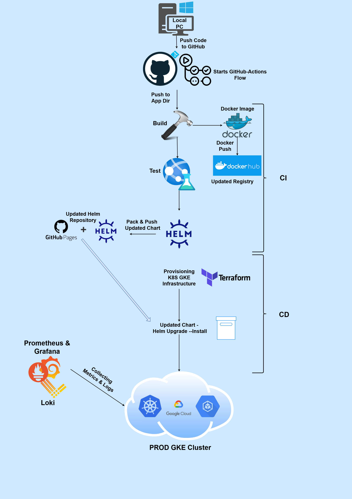

# Dog Gif App 🐶  

## Overview  
This project presents a **Flask-based dockerized web-app** integrated in GitHub Actions Flow for CI/CD automation. The app dynamically serves a random dog GIF from a **dockerized MySQL database** every time the page is refreshed. It also keeps track of visitor count by another MySQL table. The GitHub Actions flow ensures every code update is **built and pushed** to Docker Hub, then **tested** with docker compose and is **deployed to a K8S cluster**. To manage the infrastructure efficiently, **Terraform** is used to provision the **Google Kubernetes Engine (GKE) cluster** as a part of IaC implementation. Additionally, **Helm** is used for managing Kubernetes deployments, making it easier to deploy, update, and maintain the applications in this project.

### Features
- **Flask Web Application**: A lightweight Python web app.
- **GitHub Actions CI/CD**: Automated building, testing and deployment.
- **Docker Support**: Containerized for easy deployment.
- **Cloud Integration**: Ready for deployment to AWS/GCP.
- **Infrastructure as Code**: Terraform for cloud provisioning and Helm for Kubernetes deployment.
- **Monitoring & Logging**: Integrated Prometheus, Grafana, and Loki for observability -
  - **Prometheus**: Collects application and infrastructure metrics.
  - **Grafana**: Visualizes data through dashboards.
  - **Loki**: Collects and stores logs for easy querying and analysis.

---
## Project Flow Chart


### **CI/CD Flow Breakdown**  

1. **Code Push & CI/CD Pipeline Trigger**  
   When new code is pushed to the app/ path in the repository, GitHub Actions automatically detects the change and triggers the CI/CD pipeline. This ensures that every update follows a structured, automated deployment process.  

2. **Building the Docker Image**  
   The pipeline starts by building a new Docker image of the Flask application. This image encapsulates all necessary dependencies and configurations, along with the updated code, ensuring a consistent runtime environment across deployments. The Dockerfile is used as a "recipe" to wrap the application and pack it as a docker image.  

3. **Pushing the Image to Docker Hub**  
   Once the Docker image is successfully built, it is pushed to Docker Hub, a public cloud container registry. Storing the image in Docker Hub will allow pulling it later on. Each flow run has a different github run-number used to tag the image that is pushed on every run. This way its easy to pull the image later by specifying its version, enabling stable version - management. 

4. **Testing with Docker Compose**  
   Before deploying to the production environment, a local test is executed using Docker Compose. This ensures that the containerized application runs as expected with no critical errors - before being deployed to the Kubernetes cluster. The test includes a curl to the flask app in order to verify the application is running correctly, sending a HTTP request to the app exposed port, 5000.

5. **Updating the Helm Chart**  
   After passing the test phase, the pipeline then uses Helm, a package manager for Kubernetes. Helm defines the application's infrastructure and configuration settings that will be deployed to the cluster as kubernetes manifests. Before packing, the github run-number, that is the same number in which the updated docker image is tagged - is inserted to the chart to ensure that later this image will be used to upgrade the helm release. The updated chart is packed and pushed to github pages helm repository. This step ensures that the latest updated chart is always available to install for deployment.

6. **Infrastructure Provisioning with Terraform**  
   Terraform manages the Kubernetes infrastructure by provisioning and maintaining the GKE (Google Kubernetes Engine) cluster, ensuring scalability and consistency. The tfstate file, which tracks resource states, is stored remotely in an S3 backend for centralized state management. To prevent conflicts in concurrent deployments, Terraform uses DynamoDB for state locking, ensuring only one operation modifies the infrastructure at a time.

7. **Deploy to Kubernetes**
   Once the infrastructure is set up, Helm deploys or upgrades a release in the Kubernetes cluster using the latest Helm chart version, which includes the newly built image. Since the Chart.yaml version is incremented and the updated image tag is pushed to values.yaml on every run, helm upgrade ensures that the new release is fully applied, replacing outdated resources with the latest configuration and container image.  

8. **Exposing Metrics with Prometheus & Monitoring**  
   Once deployed, the application not only serves random dog GIFs but also exposes Prometheus-compatible metrics. These metrics include visitor counts and other key performance indicators, allowing real-time monitoring of the application's usage, health and stats. Prometheus continuously scrapes the application's exposed metrics, providing real-time insights into its behavior. These insights are visualized using monitoring tool Grafana, which is allowing a graphical user-friendly performance analysis.  

9. **Continuous Logging and Issue Detection with Loki**
Loki, a log aggregation system designed for Kubernetes, is deployed using Helm to enhance observability.
Once deployed, Loki collects logs from the running application and other Kubernetes components, allowing for centralized log storage and easy retrieval. These logs are then accessible through Grafana, enabling real-time log analysis, troubleshooting, and debugging. This way, the system ensures that any errors, anomalies, or unexpected behaviors in the application can be quickly identified and addressed, improving reliability and maintainability.  

**This pipeline ensures that every code change is built, tested, validated, and deployed automatically while maintaining observability and infrastructure consistency.**

---

## 📦 Setup Instructions 

The following tools are widely used in this project:
- **Python & Flask Module**
- **Docker** - for containerized deployment
- **Terraform** - for cloud infrastructure provisioning - a k8s cluster
- **Kubernetes** -  Runs and manages the flask app in a scalable and automated way.
- **Helm** - Simplifies Kubernetes deployments by packaging configurations and managing updates efficiently.
- **GitHub Actions** - CI/CD Workflow

### 🔑 Required Secrets  

To use this project, you need to **configure all required secrets and variables** in your GitHub repository's **Actions > Secrets > Repository secrets / variables** section.  
Go to **GitHub Actions → Secrets** and add the following secrets:  

#### GitHub Secrets:
- `dockeruser`: Docker username for login.
- `dockertoken`: Docker token (password) for login.
- `MYSQL_PASSWORD`: MySQL password for authentication.
- `MYSQL_ROOT_PASSWORD`: MySQL root password.
- `HELM_REPO_PAT`: Personal Access Token for Helm repository access.
- `AWS_ACCESS_KEY_ID`: AWS credentials for accessing S3 and other AWS services.
- `AWS_SECRET_ACCESS_KEY`: AWS secret key for S3 and other AWS services.
- `GCP_SA_KEY`: Google Cloud Service Account Key for GCP access.
- `GCP_PROJECT_ID`: Google Cloud Project ID.
- `GCP_CLUSTER_NAME`: Google Cloud Kubernetes cluster name.
- `GCP_ZONE`: Google Cloud zone for the Kubernetes cluster.

#### GitHub Variables:
- `FLASK_ENV`: Environment for Flask (e.g., development or production).
- `MYSQL_HOST`: Host for the MySQL database.
- `MYSQL_USER`: MySQL user.
- `MYSQL_DATABASE`: The MySQL database name.
- `PORT`: Port for Flask to run on.
- `IMAGE_TAG`: Docker image tag, generated dynamically based on the GitHub run number.
- `IMAGE_NAME`: Docker image name (`crazyguy888/catexer-actions`). 

After configuring these secrets and variables, the GitHub Actions pipeline will be able to **build, test, push, and deploy** the application automatically.  

---

## 🐳 Docker  

The app is **containerized** using Docker, allowing it to be easily deployed in any environment.  

### 🔹 Dockerfile  

The **Dockerfile** defines how the Flask app is packaged:  
- Installs dependencies and Flask runtime.  
- Copies the application files into the container.   
- Configures the web server to serve the app.  

### 🔹 Docker Compose  

A **docker-compose.yml** file is included to facilitate **local testing** before deployment. It allows running the app along with its database locally.  

To test locally:  

```sh
docker compose up --build
```

After startup, you can verify the app is running using:  

```sh
curl http://localhost:5000
```

---

## 🌍 Infrastructure as Code (Terraform)  

Terraform is used to **provision and manage** the Kubernetes infrastructure on **GCP**.  

- **Google Kubernetes Engine (GKE)** is created using Terraform.  
- **AWS S3 is used as the Terraform backend** to store the infrastructure state remotely.  
- **DynamoDB is configured** to enable state locking and prevent conflicts.  

To deploy the infrastructure:  

```sh
terraform init
terraform apply
```

---

## ☸️ Kubernetes & Helm  

In this project, Kubernetes (k8s) is used for orchestrating the deployment and management of the flask app. It helps ensure scalability, load balancing, and fault tolerance by running the application in containers across multiple nodes. Kubernetes manages the deployment lifecycle, automates rollouts and rollbacks, and integrates with monitoring tools like Prometheus and Grafana for observability. The application is deployed in **Kubernetes (K8s) using Helm**, which simplifies and standardizes the deployment process. **Helm** acts as a package manager for Kubernetes, allowing for easy installation, upgrades, and rollbacks of the application.  

### 🔹 How Helm is Used in This Project  

- **Application Deployment**: Helm templates are used to define Kubernetes manifests for the Flask app, ensuring consistent deployment across environments.  
- **Environment Configuration**: Helm values allow customization of deployment settings, such as resource limits, replica counts, and environment variables.
- **Service Exposure**: A Kubernetes **Service** is defined to expose the application and allow external access.   
- **Automated Updates**: The CI/CD pipeline uses Helm to automatically deploy the latest version of the app whenever a new image is built and pushed to Docker Hub.  

### 🔹 Deploying with Helm  

Helm is used to deploy the Flask application to Kubernetes. The repository includes a Helm chart to manage application deployment.
To install the application using Helm:  

```sh
helm repo add catexer-repo <your-helm-repo-url>
helm install $HELM_RELEASE_NAME catexer-repo/helm-flask
```

To uninstall the application:  

```sh
helm uninstall $HELM_RELEASE_NAME -n $NAMESPACE
```

---

## Monitoring and Logging: Prometheus, Grafana & Loki

To ensure application performance monitoring and effective debugging, Those tools are integrated: Prometheus for metrics collection, Grafana for visualization, and Loki for log aggregation.

### Prometheus
Prometheus collects metrics from the Flask application and provides insights into request durations, error rates, and system performance. Ensure that the application exposes an endpoint (e.g., `/metrics`) for Prometheus to scrape data.

### Grafana
Grafana connects to Prometheus as a data source, providing real-time dashboards for monitoring key metrics.

### Loki
Loki centralizes logs from the Flask application, making it easier to query and analyze application behavior.

---

## Security Considerations

Ensuring security best practices is crucial to protect the application from vulnerabilities.
In this project a couple of security measures are used to ensure that:

- **GitHub Secrets:** Used for CI/CD pipeline credentials such as Docker and GitHub tokens, ensuring sensitive information isn't exposed.
- **Kubernetes Secrets:** Database credentials are stored securely in base64-encoded Kubernetes secrets.
- **Git and Docker Ignorance:** .gitignore and .dockerignore files prevent sensitive or unnecessary files from being tracked or added to Docker images.
- **SSL ( HTTPS ):** SSL encryption is enabled to secure data transmission, ensuring that all communications are encrypted.

---

## 🔄 Application Flow  

Below is a high-level overview of how the flask app functions from development to deployment:  

1. **Development**: Developers work on the Flask application locally and can test it using Docker Compose.  
2. **CI/CD Pipeline**:  
   - Code is pushed to GitHub.  
   - GitHub Actions trigger a build process.  
   - The Flask application is built as a Docker image and pushed to Docker Hub.
   - A test is executed using Docker Compose to verify that the updated code doesn’t break the application's functionality.
3. **Kubernetes Deployment**:  
   - The latest Docker image is pulled from Docker Hub.  
   - Helm deploys the application to the GKE cluster.  
   - Kubernetes ensures high availability and manages scaling.  
4. **Monitoring & Logging**:  
   - The application exposes **Prometheus-compatible metrics**.  
   - Prometheus scrapes the metrics, providing real-time insights, showed later by grafana.
   - Loki collects and aggregates logs, offering seamless log monitoring. 
5. **Automatic Updates & Rollbacks**:  
   - When new code is pushed, the CI/CD pipeline rebuilds the Docker image and updates the deployment via Helm.  
   - If issues occur, previous versions can be rolled back using Helm.  

This flow ensures a **fully automated, scalable, and monitored deployment** of the flask app in the **Kubernetes cluster on GCP**.  

---

## 🧹 Cleanup  

To keep the environment clean and avoid unnecessary storage costs, several cleanup processes are included in the project:  

### 🗑️ Docker Hub Image Cleanup  

Over time, multiple Docker images can accumulate in **Docker Hub**, leading to unnecessary storage usage. To manage this, a **Docker Hub tags cleanup script** is included in the `cleanups/` directory. This script helps **remove outdated or untagged images** to keep your repository organized.  

To execute the cleanup script:  

```sh
bash cleanups/docker-clean.sh
```

Ensure you have **Docker Hub credentials** set up to authenticate with the Docker API before running the script.  

### 🗑️ Helm Chart Cleanup in GitHub Pages Helm Repo  

Helm charts used for deploying the application are stored in a **Helm repository hosted on GitHub Pages**. Over time, as updates are made, older chart versions can accumulate, leading to clutter and unnecessary storage usage.  

To clean up old Helm chart versions, a **bash script is provided in the `cleanups/` directory**. This script:  

- **Clones the GitHub Pages Helm repository:** fetches a local copy of the repo to make changes.
- **Restores original modification times:** it ensures the files retain their original modification times, keeping the history intact even after cloning.
- **Identifies and deletes older versions:** The script lists all .tgz files (Helm chart archives) in the repository, sorts them by their age,
   and removes the oldest versions while preserving the latest N versions (default is 3).
- **Pushes changes:** commits and pushes the changes to the GitHub Pages repository, ensuring the cleanup is reflected in the live repository.  

To execute the Helm chart cleanup script:  

```sh
bash cleanups/helm-clean.sh
```

This process helps you maintain a clean and organized Helm repository, ensuring that only the most recent and relevant chart versions are stored and available for deployments.

---
