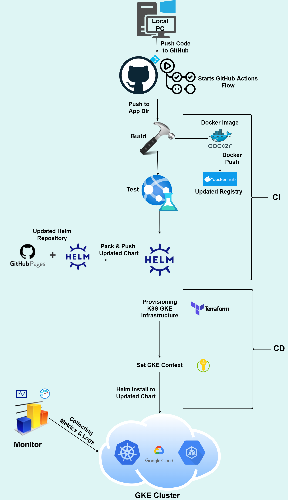

dog gif app

python app -
this app is flask -baes web app that displays a random image pulled from docker db every time page is refreshed and following after visitors count. it serves prometheus compatibale metrics and deployed in k8s environmment in gcp. updates in the app are built and pushed to docker hub then used in k8s cluster with a ci cd github actions flow.

to run this project in your repo,
ensure you have these creds saved as secrets/vars in your actions/secrets tab:
secrets:

vars:

docker -

the app is containerized using docker to/for ....

dockerfile - role expanded
docker compose - for testing in the runner using curl - see it works locally before deploying with db

terraform - 

used for what, cluster gke what doing, etccc
backend s3 aws creds
dynamodb lock

k8s and helm - 

helm rule and advantages what it enables. k8s also
helm repo

clean up - what cleanups we do

